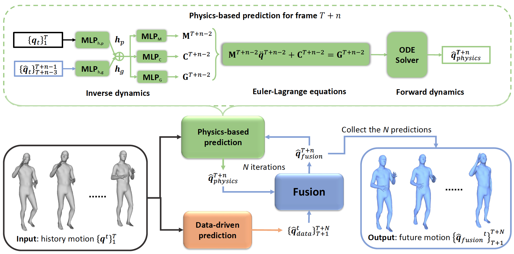

# PhysMoP: Incorporating Physics Principles for Precise Human Motion Prediction

**Incorporating Physics Principles for Precise Human Motion Prediction** <br />
  [Yufei Zhang](https://zhangy76.github.io/), Jeffrey O. Kephart, Qiang Ji <br /> 
  WACV2024, [Paper](https://openaccess.thecvf.com/content/WACV2024/papers/Zhang_Incorporating_Physics_Principles_for_Precise_Human_Motion_Prediction_WACV_2024_paper.pdf) | [SupMat](https://openaccess.thecvf.com/content/WACV2024/supplemental/Zhang_Incorporating_Physics_Principles_WACV_2024_supplemental.pdf) <br />


This repository includes the training and evaluation code for the above paper. 

## Installation
### Environment
```bash
conda create -n physmop python=3.8
conda activate physmop
pip install -r requirements.txt
```

### 3D Human Model 
Please download [SMPL](https://www.dropbox.com/scl/fi/kosyc0onvvkykdpq2w69e/processed_basicModel_neutral_lbs_10_207_0_v1.0.0.pkl?rlkey=qrrqr96nbpnux86qi1wfxj9sf&dl=0) and [SMPL-H](https://download.is.tue.mpg.de/download.php?domain=mano&resume=1&sfile=smplh.tar.xz), and store them under the current directory as 
```
|--dataset
|  |--smpl_official
|     |--female
|       |--model.npz
|     |--male
|       |--model.npz
|     |--neutral
|       |--model.npz
|     |-- processed_basicModel_neutral_lbs_10_207_0_v1.0.0.pkl
```

## PhysMoP Model Training & Evaluation
Please follow the procedure below to conduct the experiments on AMASS.
### Data Preparation
Download the raw 3D motion sequence data from [AMASS](https://amass.is.tue.mpg.de/) (should be similar for [Human3.6M](https://drive.google.com/drive/folders/1ySxiuTCSdUEqbgTcx7bx02uMglPOkKjc?usp=sharing) and [3DPW](https://virtualhumans.mpi-inf.mpg.de/3DPW/)), and store them under the current directory as 
```
|--dataset
|  |--data_raw
|     |--AMASS
|       |--ACCAD
|       |--BioMotionLab_NTroje
|       |--CMU
|       |-- .
|       |-- .
|       |-- .
|  |--data_processed
```
Preprocess the raw data
```
python AMASS.py
```

### Training
PhysMoP is trained in three steps:
#### 1. Train the data-driven model
```
python train_script.py --name data --data True --num_epochs 5 --keypoint_loss_weight_data 1 --pose_loss_weight_data 2
```
#### 2. Train the physics-based model with the checkpoint (DATA_CHECKPOINT) obtained from step 1.
```
python train_script.py --name data_physics --data True --physics True --pretrained_checkpoint DATA_CHECKPOINT --keypoint_loss_weight_physics_gt 1 --pose_loss_weight_physics_gt 2 --num_epochs 2 --keypoint_loss_weight_data 1 --pose_loss_weight_data 2 --resume
```
#### 3. Fix the data-driven and physics-based model and train the fusion model with the checkpoint (PHYSICS_CHECKPOINT) obtained from step 2.

```
python train_script.py --name data_physics_fusion --data True --physics True --fix_weight True --fusion True --pretrained_checkpoint PHYSICS_CHECKPOINT --keypoint_loss_weight_physics_gt 1 --pose_loss_weight_physics_gt 2 --num_epochs 2 --keypoint_loss_weight_data 1 --pose_loss_weight_data 2 --keypoint_loss_weight_fusion 1 --pose_loss_weight_fusion 2 
```
The saved model checkpoint can be found at './logs'.

### Evaluation
To evaluate a model saved at CHECKPOINT_PATH, please run
```
python eval.py --checkpoint CHECKPOINT_PATH
```

After code re-organization, we re-produced the results as
```
|  AMASS-Test  |   80ms |  160ms |  320ms |  400ms |  560ms |  720ms |  880ms | 1000ms |
| ------------ | ------ | ------ | ------ | ------ | ------ | ------ | ------ | ------ |
|  MPJPE (mm)  |    0.4 |    2.0 |    9.4 |   14.2 |   24.4 |   36.1 |   48.0 |   61.9 |
```
The evaluated checkpoint, which includes model weights and training log, can be downloaded via [FINAL_MODEL](https://www.dropbox.com/scl/fi/qfovsy30net1wt2zl04bw/2023_12_21-17_09_24_20364.pt?rlkey=2phz52d26p2w2hbtx50o89c50&dl=0).

## Citation
If you find our work useful, please consider citing the paper:
```bibtex
@InProceedings{Zhang_2024_WACV,
    author    = {Zhang, Yufei and Kephart, Jeffrey O. and Ji, Qiang},
    title     = {Incorporating Physics Principles for Precise Human Motion Prediction},
    booktitle = {Proceedings of the IEEE/CVF Winter Conference on Applications of Computer Vision (WACV)},
    month     = {January},
    year      = {2024},
    pages     = {6164-6174}
}
```

If you have questions or encouter any issues when running the code, feel free to open an issue or directly contact me via: zhangy76@rpi.edu.

## References
Part of our code is developed based on [siMLPe](https://github.com/dulucas/siMLPe). The SMPL model data is downloaded from [SMPL-X model](https://github.com/vchoutas/smplx). We thank them for generously sharing their outstanding work.